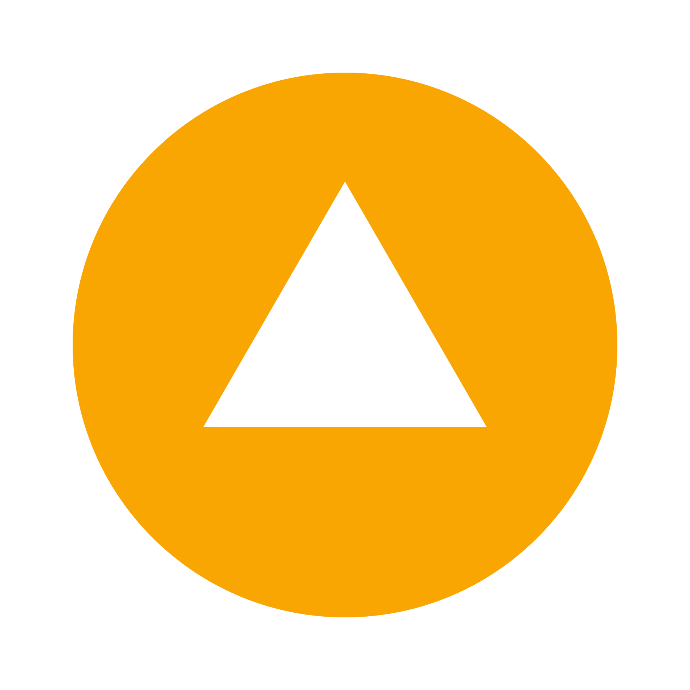
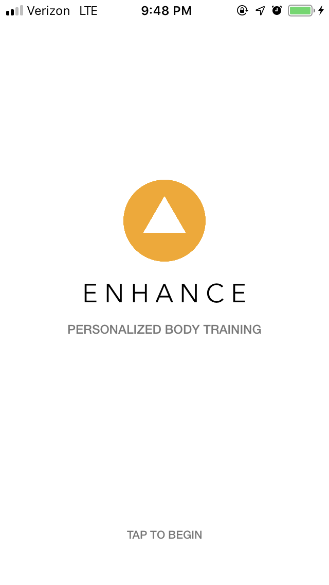
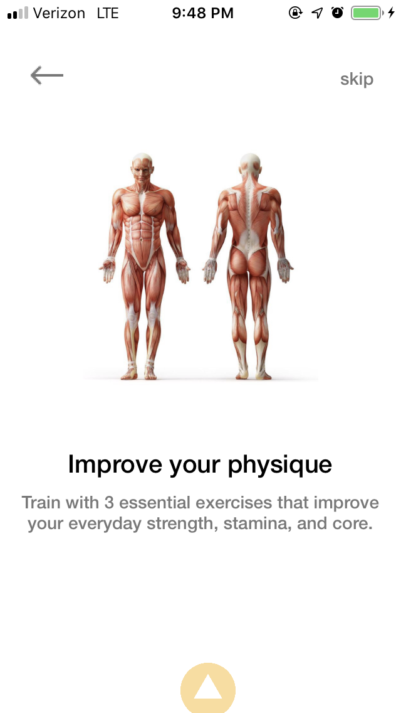
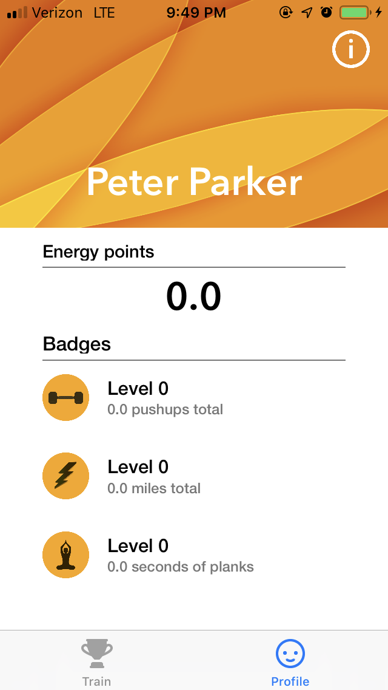
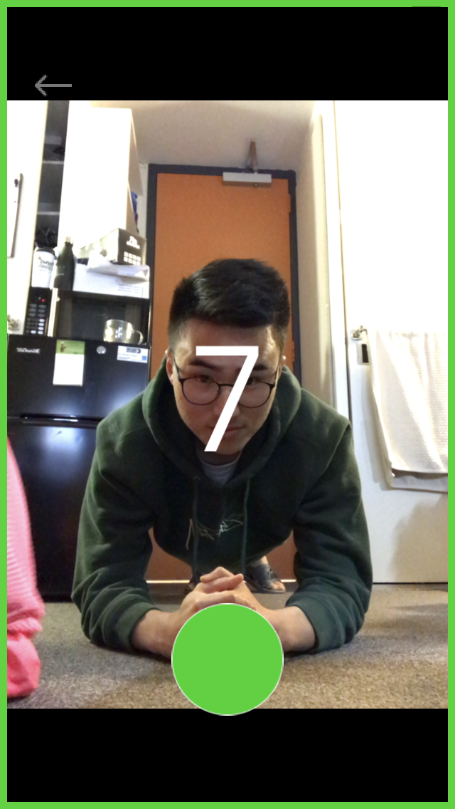
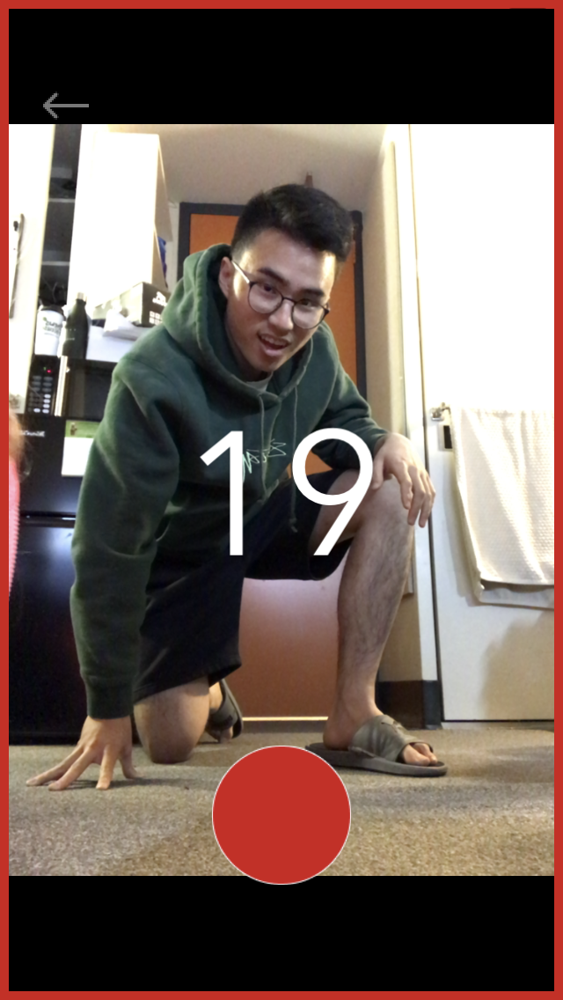

# Enhance # 

Enhance is a fitness training program designed to improve strength, endurance, and core for people with busy lives. In its first iteration, each person is provided with a set of three essential exercises—push-ups, planks, and timed jogs. Unlike most fitness apps, **Enhance keeps you accountable**. It uses frameworks like OpenPose and CoreMotion to verify that you are performing the exercises correctly and consistently. Users can track their progress overtime as they get into the habit of completing these three daily exercises.

The more you train with Enhance, the more you’ll improve crucial physical skills that are proven to boost your well-being, discipline, and self-confidence. Users who train with these three activities daily have reported gains in physical ability and increased confidence.

See a video demo [here](https://www.youtube.com/watch?v=mhfjlfFoDBY "Enhance Demo")

## Motivation ##

The motive behind this product was to create a fitness application designed for people with busy lives, whether it be college students or working professionals. I wanted to create a fitness app entirely different from the ones that already exist on mobile devices. Currently, most fitness apps claim to offer a personalized and guided daily workout routine. However, users don't always have someone to correct their form or perfectly time their sets. Furthermore, many users don't have convenient access to a gym. Enhance integrates the advantages of existing fitness apps (profile, stats, etc.) with the new solution of using computer vision and machine learning to guide them through their workouts, verfying their form in the process.

## Build Status ##

The product has just finished its first iteration. All fundamental UI elements and controllers have been implemented and primed. User data is connected to Google's Firebase and the app reads from and writes to it effortlessly. Currently there are only three activities available: pushups, planks, and timed jogs. The CoreML models for pushups and planks are not quite perfect, but they're continually being improved through collection of data and adoption of more advanced technologies.

## Screenshots ##

See the full demo [here](https://www.youtube.com/watch?v=mhfjlfFoDBY "YT Demo")
